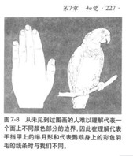
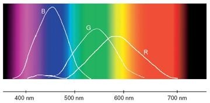

## 色彩基础
所谓大千世界，形形色色，形与色构成我们大部分视觉世界, 但相比之下，形状在大脑里形成的层次应该比较高，你从未在现实的世界里见过素描里的线描人物，也没见过中国画的墨骨山水。当心理学家来到巴布亚新几内亚的一个小部落桑各族(songe)，给当地人看如下的线描画，当地人一脸茫然，他们的逻辑开始随处发散，比如认为半月形的指甲是因为脱落断裂了，鹦鹉碎渣渣的羽毛是因为被砍过几刀……(库恩，心理学导论p227)

 

在有抽象能力的现代世界里生活过的我们，人们已经能从极简的图形中辨认出各自的含义，但色彩是实实在在的东西，哪怕再抽象的绘画，之中的色彩你还是在现实中见过。

色彩有它错综复杂的一面，但基础知识却比较简单。色彩是对光的感受， 对于光，在物理学里我们有大量对光的描述，我们的回忆也许回到了中学物理课本里牛顿分解白光的故事。1666年，牛顿拿着一块三棱镜站在暗室里，他发现白光透过透镜分解成彩虹般的颜色，所谓七彩的赤橙黄绿青蓝紫，不同波长的光混合形成了白光，然后因为每种光在透镜里的折射率的不同，这些不同频率光按波长顺序排列在白板上，这是白光的分解，反过来，如果我们有这七种颜色的灯光，将他们一起照在一块白板上，也能重新合成白色。
 可光和颜色还是有一点的差别，N久以前，当心理学家把几种不同的颜色一块块地涂在一个转盘上，然后快速转动盘子，新的颜色就在这飞快的转盘上形成了，转盘的颜色迥然不同，眼中的颜色浑然一体，这是个错觉，可也说明颜色是一种心理作用，是感觉。
当大千世界的光线们偶然地落入了眼睛，他们首先经历了一个透镜聚焦的过程，他们通过由虹膜、瞳孔、晶状体、巩膜等组成的，复杂而精密的眼球，落在了视网膜上。
我们的视网膜上居住着两种视觉细胞，一种叫视杆细胞，一种叫视锥细胞。视杆细胞只在弱光条件下提供低分辨率的视觉，而每个视锥细胞在亮光中提供高分辨率的视觉。视锥细胞和我们的色彩视觉关系很大。 

一般人的视锥细胞有3种，三种细胞各自对光产生反应，被神经经过某种形式的处理，才产生我们最后的色彩知觉。你也许想起了RGB和三原色，3种色彩可以合成所有的颜色，那这三种细胞就是感受红黄蓝色的呗，可值得注意的是，三种细胞都看得见一定范围内的光，对光谱中的光，Ⅰ细胞可以看到紫 蓝 绿光  Ⅱ细胞为蓝绿黄，Ⅲ细胞为 绿黄橙红。
 
 想象大脑是一台机器，有了这3种细胞得到的输入值，我们就可以产生丰富的色彩感觉。那么借机理解一下红绿色盲的世界，普遍认为，红绿色盲是因为视锥细胞Ⅱ和Ⅲ丢失了一种，或者是对两种细胞产生的刺激一视同仁，所以，红绿色盲无法辨别红绿，他们眼中只有蓝色和黄色。
 
 回到非色盲的世界，对照下图：我们可以发现570nm的时候，光谱上是黄光，此刻的眼睛中，主要吸收红光的Ⅲ细胞和主要吸收绿光的Ⅱ细胞返回的刺激数量相等，如此，我们也可以把红光和绿光一起投射给眼睛，细胞返回的刺激相同，所以我们看起来，红光和绿光混合出了黄光，但物理上红光和绿光加起来和黄光没关系。
 
 就这样我们从底层上可以理解三原色：我们色彩感觉的根源大致在这3种细胞的刺激上，许许多多视锥细胞形成了一个数据源。通过眼球表面的细胞，复杂的物理世界的光，在这些细胞上被编码为3种刺激，设想在自然界里一束光射入眼睛，总是让眼睛的Ⅰ细胞感受到数值为R的刺激，Ⅱ细胞数值为G，Ⅲ细胞数值为B。换言之，每种刺激可以归结为一个通道上的的数值。
 
 所以，我们也许可以选定某个特定波长的光，几乎只对3种细胞的某一个产生影响，比如，某种红光几乎只对Ⅰ细胞产生了反应，其他细胞没啥刺激，还能找到某种绿光和某种蓝光，各自影响一种细胞。不知百年前的色彩学家是不是在发现了这些规律的时候想象了一个充满屏幕的未来世界，但这个发现确实很流弊，想象自然界的任何一朵光线，在视网膜上产生的信号，最初都是视细胞的3个分量叠加，也就是可等效为我们刚才说的3种特定的光谱的不同比例叠加。

 许多年后，这些特定光谱的光形成了我们我们显示器的像素点，每一粒像素的RGB光线不一样，离远了就混成一种新的颜色。而各种颜色在我们的程序里被理解成了矢量，你知道矢量的定义是每个维度之间几乎是不相互影响，和这些光在眼睛里产生的信号效果是一样的，他们是一个虚拟色彩世界的向量基。
 
然而，RGB只是和显示器和视网膜的原理有关的色彩模式，可我们并不以RGB模式去理解色彩世界。我们不会说“天空比昨天还绿啊，桔子有80%的红和20%的绿”这样的话，而是为这些色彩创造了形形色色的名字，赤橙黄绿青蓝紫，还有更为细致的石绿、品红、紫红…..并且用鲜艳、黯淡、明亮这样的词汇去描述它。

所以我们需要一种更加接近人类思维的模式去刻画颜色，为了让电脑更懂人的感受，我们发明了许多不同的色彩模式，比如HSB(HSV)、HSL、LAB这样的色彩空间。我简单介绍下HSB（HSV）模式（这种模式应用很广，比如photoshop你就能找到他）。
HSV模式用三个指标去刻画一种颜色，H是色相，我们通常会把色相排列在一个环上，这是一个无始无终的循环，赤橙黄绿青蓝紫，绕了一圈最后还是落在了红色上。所以，通常我们也把色相H理解成角度，绕圆一圈角度走过360度，所以色相的范围通常落在0-360里，其实360度和0度是一样的。

 怎样用一种很屌丝的方法去理解这些值是怎样通过rgb值进行换算的？想象在任何光里加入白光，就像在任何颜料里掺入水，色彩（H）是不变的，淡了一点而已。如此，假设我们拥有一束R：250，G：100，B：50的光，我们可以等价地看成一束光A:{R：210，G：60，B：0}的光加上一束灰色的光B{R：40，G：40，B：40}，而前者介于R红色和G 绿色之间。略加抽象下，我们可以假设一种颜色为R,G,B，最大的是max，最小的是min，那束白光强度就是min，那个介于某两个颜色的光，我们通常用色相来表示。R210，G60，我们就可以线性地平均下，因为R的比例多些，我们可以在色环上找到这个颜色，偏红。
 
 这样，我们就找到了色相H的计算方法，还有2个指标，一个是饱和度，刻画色彩鲜艳的程度，另一个是明度，可以理解成亮度。HSV里的明度是 V(B)=max，明亮的程度取决于RGB中最大的那个值，而S=(max-min)/max，我们可以理解为最大的刺激和最小的刺激占最大刺激的比重。我们还有HSL模式，在这种模式中，H的算法和HSB模式是一样的，但S、L有些不一样。为臻于心理感觉更准确的色彩模式当是LAB模式，不详展开了。