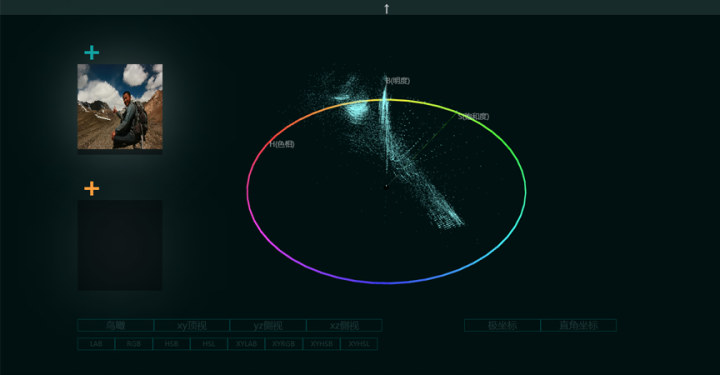

# 色彩

一首曲子高八度唱，声音截然不同，旋律还是一样，但单独的声音意义不大，我们通过一串单独的声音组成的整体辨识出旋律这种美丽的模式，正如烹调在于搭配，你不会爱单独吃醋啃辣椒舔芥末，食物和调料组成的整体才让我们可口怡然。同理我们注重色彩和色彩的关系，单独的色彩很难有很大的吸引力。可我们还是经常问人最喜欢哪种颜色，甚至说你所喜欢的某个色彩可以反映你的性格，我相信这是非常武断的事情，单独的颜色没有太多意义。

之前我们讨论了某个颜色怎么产生，如何在计算机里表示，显示器上合成，但颜色和其他颜色怎样组合才好看。

## 色彩空间
每张图片都是一堆像素，每个像素对应一种色彩，每种色彩有色彩模式，除了RGB，还可以是HSB：色相（H），饱和度（S），明度（B），HSB更符合人们判断色彩的习性，此外还有HSL、LAB等别的模式。色彩模式之间相互有着转换公式，可以详见一个叫做easyRGB的网站（图）。不过无论哪种色彩模式，每个色彩都有3个维度，3个维度彼此独立，也就是如果以色彩的三个维度为坐标轴，就形成一个色彩空间。通常，这个坐标系由xyz三个相互的轴线形成，但HSB、HSL模式中色相(H)经常被理解成角度，由此我们可以得到一个圆柱坐标系，可以想象359度的色相和1度的色相非常接近，但在直角坐标系中，他们的距离差之千里，因此圆柱更科学。

对于我们看到的任何一张图片，或者说视网膜上真实世界拍平形成的输入矩阵，从像素群的角度看，都有5个维度，每个像素除了色彩上的3个维度，还有位置坐标x、y。这个五维度的数据集，是我们视觉原始的出发点。

于是我和同事做了这么个在线图片[分析工具](http://color3d.herokuapp.com/)（请用chrome访问），我们将用这个工具玩转各种图片的分析，且待下文。

## 色彩构成
 你想分析图片的色彩构成，最简单的方法是把每个像素的色彩变成一个点，丢掉位置信息，挨个丢到色彩空间里，就形成一团点云，我们可以在这里观察某张图片的色彩分布：我为点云设置了透明度让他们不至互相遮挡，又让点云相互遮挡的时候色彩叠加显得更加明亮，所以最耀眼的地方就是像素分布最多的地方。由此我们马上能发现，绝大部分图片即使色彩再花俏，如果我们在HSB空间下查看图片的色彩分布，通常会发现此图只有几个色相，也就是只占领色彩空间的一小部分

接近一步，我们将问题简化，不讨论明度也不讨论饱和度，只看看色相的关系，也就是粗略地知道哪些颜色配起来好看。对此我相信你早已有很多配色的经验，比如你应该知道什么颜色的衣服配什么颜色的裤子，而经验又告诉我们一些常识性的东西，有些图片是纯色的也很好看，澄净美丽的无垠蓝天，日落暖黄的大地万物，四月无际的金色菜花，他们都主要只由一个色相构成（但不是一个颜色！）， 色相的固定让他们显得纯净，明度和饱和度的变化让他们变得丰富。我们也会遇到许多色相互补的情况，比如北方秋天，万木黄而明亮，天空蓝而深沉，对比卓然。经过我的这个程序分析（processing+ecllipse），在这张内蒙古额济纳的秋天里，这种黄色和蓝色正好在对角线上，还记得美术老师说这叫互为补色不，视觉上对比强烈。

 

 

 

 这些图的色相紧密地分布在几个峰值附近，在微软亚洲研究院的这个paper里指出，一张漂亮的图片里，色相往往只有几个，而他们之间会产生一定的夹角，这些夹角产生了诸如对角线、三等分等几种模式，这些模式就是色彩搭配的规则。
 从这些简单的规律出发，我们发明了很多经验的配色算法，虽然名字形形色色，其实原理大同小异，无非约束了几个相互协调的色相，有时候再去约束明度和饱和度的关系，简要介绍下：
 
1. Complementary:互为补色，色相角度差180，想象一下秋天的树林和天空！这类配色往往对比度比较大。
2. Split-Complementary color scheme ：这是1的延伸，
3. Triadic：三等分角度，各自呈现180度
4. Analogous ：相邻的颜色，想象有梯度的渐变。

## 蓝天，渐变，QQ的UI（色彩-位置分析）
 曾经喜欢夏日午后在树下仰望天空，记忆里天空很美，可后来我从来就没有在颜料中调出那种性感的蓝色。后来我又买了一个带着偏振镜的单反相机，每次拍摄天空的时候带着暗角，这种效果加剧了天空中那种蓝色变化。

这种渐变也充满了我们的UI设计，如QQ和旺旺的界面。我们可以在程序里分析他们。这是我写的一个processing程序，沿着箭头方向划一道线，把所有的像素点排列在直角坐标轴里，我们可以发现：这些蓝色的渐变色相都保持着固定，在hsv模式中，一端是明度极高，饱和度很低的亮端，另一端则是饱和度高，明度很低的暗端，换言之，如果让一堆色相相同的颜色保持和谐，可以使明度低的颜色饱和度高，明度高的颜色饱和度低。

 

作为一个可视化工程师，我觉得这个发现是有意义的，在数据可视化中，我们通常用颜色去标记数量的大小，不同色相的颜色可以表示不同维度的数值，而相同色相则可反映数量的变化。色相相同的颜色里，随着数值增大，亮度和饱和度究竟各自会增大还是减小，会在视觉上看起来更和谐？或许我们可以找到一个函数，可以对任意的数字显示一个特定的颜色：
 Color = color（k），其中0<k<1,color是我们想知道的转换函数
 按照我们刚才分析的逻辑，粗糙地假定亮处s为0，b为1，暗处s为1，b为,0我们可以猜测配色关系可以是：
 
 1.Color = HSB(H,1-k,0+k)，其中0<k<1

 另外，色彩模式可以为HSL，和HSB类似。
 事实上，1和2式，3和4式是一样的，如果另k1=1-k代入式子就显而易见。于是我们可以实验，在一个长条上置入颜色，容易发现，和天空模式最接近的是色彩最和谐的：

  

 考虑亮处和暗处的反差没那么明显，设最亮处的明度为Smax，暗处为Smin，饱和度最大与最小分别为Bmax，Bmin，那么对某输入数值k而言:
S = map(k,Smax,Smin),
B=map(k,Bmin,Bmax),
Color = HSB(H,S,B).
其中function map(k,min,max) =min+(max-min)*k。
 最后，让我们测试下这个算法对所有的色相都比较和谐!

 我们也容易发现，在不同的可视化图中，这种算法都能调出和谐的颜色：

## 复杂性
 你身上的红衣服和他的红衣服可能很不不一样，搭配的辅助色不一样，材质不一样，甚至只是因为背景环境不同......
 相同的色彩在不同的环境里给人感觉不同，我们对色彩的判断易被环境影响，甚至，我们不需要色彩，用一个超有名的错觉说明这点，这个叫Checker shadow illusion，事实上AB点的颜色是一模一样的，不信你用photoshop吸一下。如果按照右图一样我们找个颜色把2个区域连起来，容易发现2个颜色是一样的。

 又如下图：2张图颜色构成比例完全一致，但放的位置和尺度不同，看起来还是很不一样
 颜色是受环境影响的，颜色是心理感受，时刻记住这一点。
 
 
 所以，容易发现，上文的色彩算法要适应不同的情形，是一件值得论证的事情，比如假设我们的色彩算法是：
 Color=HSB（k*360,0.8,0.5）;
 我们用同一种算法对2种不同的图案染色，第一种是有顺序的地形，色彩一层层延伸出来的时候，排列成了彩虹般的秩序，可第二种是无序的随机排列，色彩显得有点糟糕：

  
