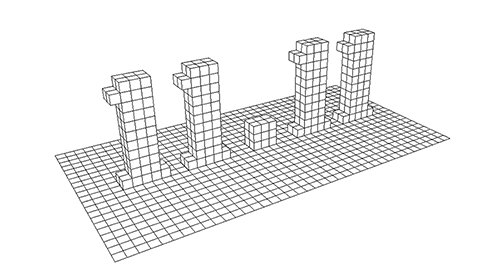
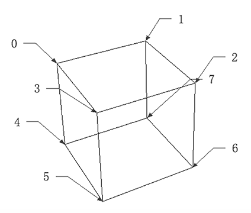
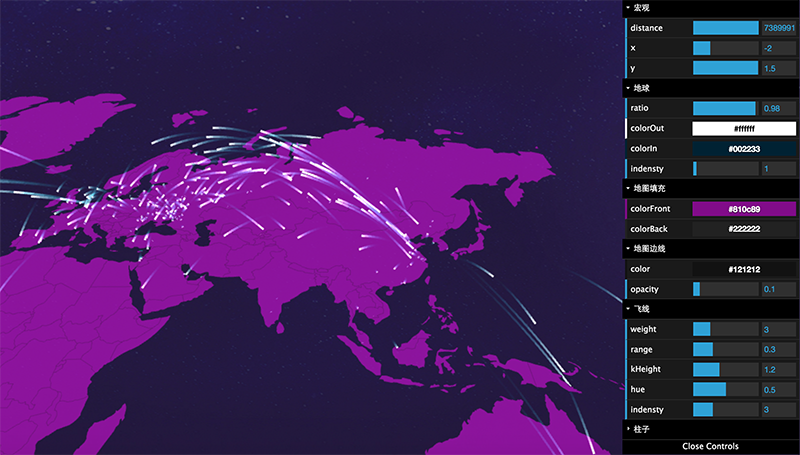

### 双十一技术要点

  今年的双十一盛况空前，海量的订单和支付数据，经由客户端和大后端的处理、公共数据平台及产品部同学的合并和清洗，到了可视化大屏前，面对数百媒体以及媒体背后的观众。
  我们如何处理和展现这些数据的。


## 一些期许
之前我们做了几年的展示类可视化项目，有些坑有些不足。十月走进项目室的时候，我们有这些期许:

1、高性能，告别内存泄露
  内存泄露一直是我们挥之不去的心病，想象几百个镜头对着马总讲话的时候，运行了10个小时的大屏忽然崩溃是何情景。
  过去的几年里，在展示性很强的场合，我们常用svg去表现复杂的图形，还记得去年为了snap.js里存在的内存泄露问题而彻夜不眠（库本身有坑，除此还会有性能问题），而且svg和普通canvas，性能有限，不能使我们能表达万级数量实时更新的图形，我们希望以更高性能的方式，去还原数据的海量。
  所以，今年大部分的屏幕都是基于webgl的，webgl中，我们又尝试了许多方法，使得性能更好，且看下文。

2、走向城市级别
全球和全境的展示，如中国的物流网络，全球的飞线图，已在历年的大屏考验里愈发成熟。
更有意思的方向在哪里？我们觉得走向城市尺度有挑战，如何表现城市错综复杂的建筑和街道结构、以及人类交易活动混沌而有序的空间分布。

3、从飞线到轨迹
飞来飞去图，展示了很多年，我们如何更进一步，更有意思地展现数据。
我们想到的一个点，是让交易沿着物流的方向行走，营造一个更真实的交易场景。

4、全面3d
2014年双十一媒体大会里，3d的可视化场景小试牛刀，今年覆盖更广。
3d之于2d，有GPU加速性能上的好处，也为可视化增加了一个空间的维度，还让某些场景更接近感官（如城市建筑的展现）

5、工程化
第一次高规格的首都双十一晚会，鞭策我们推陈出新，也把大屏开发的数量，提到了去年的4-5倍，时间非常短，调整也很多，如何标准化地去做形态各异的不同大屏？


<!--1、和设计师对接
http://www.atatech.org/articles/44292-->

## 数据清洗与demo

1、交易的轨迹
我们用公路导航模拟轨迹高德导航速度有些慢，双十一高并发的交易，不能通过实时请求导航接口绘出，需预先读取，反复优化。

淘宝收货地址以1亿计，数百万活跃卖家以1百万发货地计，可能出现的轨迹以1000000亿计，高德即使0.1秒返回一个导航轨迹，需要30万年才能爬完数据。退一步，实际的交易稀疏地多，如果我们洗一遍去年双十一的交易轨迹，倘若1亿次，也要几个月才能爬完。

理想飞在天上，现实小米步枪，事实上，我写的爬虫完全不专业，一天能爬个10000条就不错，数据返回时间有时候超过半秒一秒，且没有时间去继续优化，因此我们开始做近似：

a、我们只看北上广深的数据，因此```公共数据平台及产品部的王静```清洗了五大城市2014年双十一交易以及2015年9月的某日收货地址的混合，但这个数据还是很多。因此我们找到了 ```共享业务事业部的甘布``专家 将地址清洗成了标准的格式，如小区、办公楼、学校的标准地址，五大城市的收获地址一下子变成了10w条，并带有总交易量的count数，一图以辟之：

b、即便目前只有10万条地址，我们还是很难还原所有可能的导航，我们的相机位是城市级别的，一个北京的收货点，从杭州过来和从绍兴过来的物流，到了北京市区内的部分，应该也就是一条线，因此问题简化为，一个北京的收获地址，如果发货点不在北京，其导航路径可以归结为30个省（省会）经纬度和此经纬度的导航。但这样会计算300万条导航，还是太多了。许多收货点，一天只会收到一个货，而这个收货点在今年双十一高频率出现的概率非常小。
因此，我们最终的策略如下，为每个发货地不为收货地的收获地址，随机分配N个发货地址，发货地址为不重复的省会城市坐标， N 与 此地址上的历史交易订单数count形成函数 N = f(count)。 而 N < 30（一共三十个省）。 我们本次的f函数为线性函数。

c、我们的相机都在城市上空，城市外的轨迹看不到。因此根据城市的包围方形，切除城市外的轨迹部分。因为前端对不同轨迹的抽吸要求不一样，因此我们对这些点不做简化，对轨迹的简化移到前端处理（后详）。

这样，我把10w个收货地址，导出了15w条的轨迹的随机混合表，因此当这个地区某时刻产生了n笔交易，后端可以按照顺序去这个随机表去读取n条数据，传回前端。15w条数据，用爬虫爬取了2星期，大小数Gb。

2、国旗、国家、国际省份的经纬度等数据的爬取
感谢去年```米尔同学```整理的数据，今年新增国外省份的经纬度数据。
今年大屏的点数据，累计到国际省份，```公共数据平台及产品部的同学们```从IP库查询其收货地址，并得到省名字，其中没有经纬度。因此我们通过爬虫在google api里爬取（每天2500条，小心坑哦）。
这种粒度确实让双十一的大屏的地球点亮，但也存在问题，因为各国对于省得定义是不一样的，中国、美国、澳大利亚、加拿大和俄罗斯的省都巨大无比，但英国的一个郡有时候小如国内的地级市，因此我们发现欧洲灯火通明，美国寥若星辰（每个州的交易量很大，但在前端，点绘制限制了最大半径），其实美国交易巨大无比。
明年我们继续改进。

## 前端技术
目前任何一种绘图技术，都很难完整的去反映双十一的海量交易，但我们尽力还原最真实的情况。
数据在数据部门清理之后，进入了我们的流程。
###马良产品
总体，我们今年把所有的屏，运行在阿里云的数据产品马良上。马良是一个集屏幕管理、多屏通讯、发布打包等功能为一体的大屏生产工具，除了可以集中管理屏幕，并通过页面遥控大屏，还可以通过配置页面，实时调整已经发布上线的大屏的一些参数。

###前端模型

我们的架构防止3种情况：
1、防网络延迟/断网
2、内存泄露
3、数据量过大

我们想表现2点：
1、海量的数据展现
2、飞线群和交易情况一起涨落，比如10日凌晨海量飞线，11日早晨数量变少。

我们的原则是数据上层层缓存，层层缓冲，组件上利用好GPU通信，架构如下图。


几乎所有的屏都以一定地频率请求服务端。接收到数据后还要有处理的策略.
以我们的飞线和轨迹的处理策略为例，讲讲我们处理的流程。

飞线的数据，接口返回一般都如下格式:

```javascript
[{
  from: {
    lat: xxx,
    lng: xxx
  },
  to: {
    lat: yyy,
    lng: yyy
  },
  count: zzz
},
......
]
```

#### 数据池：
最简单的动画模型是有啥画啥。
不可能来什么画什么。页面刷新率1/60秒，要维持交易动画的绵绵不断，高频请求服务器，请求很可能无法及时返回造成积累，最后内存爆缸，何况如果下一次数据返回网络不畅，会造成延时，体验很差。

因此我们的接口以5s左右的速度去请求服务器，拿到数据的时候，也不合适直接画出来。而是在ajax请求和绘制之间，建立一个先进先出，后进后出的数据缓存。数据缓存要具有一定的长度（否则在反复轮询一组飞线，视觉上很明显）。

每一次数据到达的时候，后端会计算好此刻飞线的繁忙程度(可以理解为0-1的数字)，我们通过这个繁忙度，去控制绘制的speed（即浏览器的每一帧刷新，从数据池提取几条飞线数据），这直接决定了此刻飞线的密集度。

#### 绘制池：
在绘制层面，维护一个数量固定的飞线对象池，建立回收机制。每个飞线有一定的生命周期，当飞线生命结束（飞到了尽头）的时候，会被回收到unusing的队列里去，当新数据到来的时候，会从unsing的池子里取出飞线复活，放回到using的队列里去。有一种情况是数据量太大，根本没有空闲的飞线时候，新的数据就发过来了，这种情况下，我们拒绝绘制。

在这个绘制控制器里，我们维护一个requestAnimationFrame的线程，这比每个飞线独自起requestAnimationFrame更新自己的生命周期更节约性能。

#### 飞线组件：
今年组件和去年组件的变化，在于数量，组件除了兼容回收机制，最大的改观是所有的组件共享一个线几何体。也就是，几千条飞线其实是一条线，只是我们在视觉上隐藏了线和线之间的连接，在threejs里，建一个100000个点的线，要比 1000条100个点的线要节约大量的cpu资源，而我们把这种虚拟的飞线几何体和一整根线的点，建立了虚拟的映射关系，最后通过shader给线附着颜色。通过颜色和透明度的控制，我们可以绘制出飞线。这种飞线本质是线几何体，形态上没有三角的strip精细，但为了海量，我们选择了平衡（由于错觉，我们觉得有透明度的线比没有的更细，因此有流星拖尾的效果）。


#### 飞线的延伸
本质上，飞线就是一个有生命周期的线，全球交易图里，飞线是一根类似于抛物线的曲线，而轨迹图里，飞线沿着经纬度数据的轨迹一步步往前挪动。
其实我们可以更推广，任何线产生的动画，我们都可以用这个组件去管理和表达，只是一小部分函数发生变化.

因此，做了双十一前10亿交易额的彩蛋。我们的主要想法是，双十一海量的成交额如雨点般落在了地面上，像焊枪一样焊接出11.11几个大字，每300多万订单完成，就生成一个cube，到10亿元完成的时候，模型旋转并消失。

一方面我们可以看出成交量在不断累加，一方面，在这个时间里，折线图这种更精确的图表，可以有个缓冲时间检查是否有误。

##### 订单雨
1、smooth step函数， 这是一个有意思的函数，详见 https://en.wikipedia.org/wiki/Smoothstep
我们对 smooth step做一些改进，整体开n次方， 让线条的形态更可控

```javascript
function smoothStep(t){// t的取值 0 - 1 
  var n = 2;
  var k = 2 * t * t * t - 3 * t * t;
  return Math.pow(k, n);
}
```

我们可以利用这个函数，绘制出空间任意两点的流动关系，这比绘制贝塞尔线要高效率很多，我们用这个函数模拟了订单雨。

##### cube字
1、sketchup 和模数系统。
建筑的模数系统，设计的栅格模式，都是为了产生可控制的比例，让设计更好看更易控制。
为了在短时间内建出可控的11.11的模型，我用了sketchup建模，并打了个栅格的布局，并在模型软件rhino中提取出每个cube的中心点。
为了完成动画从下而上的变化，我们还需将每个cube的中心点按照z轴排序，但为了让同一层的立方体绘制顺序更有机，我们对同一层的点进行了随机排序。

2、一笔画问题。
我们用连续的动画生成一个的方块，需要遍历方块上所有的点。
可惜，不能完美地一笔画方块，让每个顶点出现一次，这正是哈密尔顿问题。
我们最后的路径是 0 -> 1 -> 2 -> 6 -> 5 -> 4 -> 7 -> 3 -> 0 -> 4 -> 7 -> 6 -> 5 -> 1 -> 2 -> 3。



效果：


其中还有很多细节，如用web worker进行数据处理，尤其是对轨迹数据的前端数据实时简化，如对


## 工作模式

### (设计-> 开发)  =》 (设计-> 开发 -> 设计-> 开发)
数据可视化，开发不一定能够还原设计师的美学理想。而开发有时能创造设计难用ps和ai表达的图形，如何协作？

这次，我们利用dat-gui等控制组件，根据设计稿，做出了大致的demo界面，让设计师根据拖动条，像操作软件一样进行调整，而我们通过console中打印出来的配置，返到代码里去。

这么做还有个好处，我们现场接入的都是预发和线上的页面，代码不易修改，而大屏和我们电脑的屏幕有很大的色差，所以我们可以通过这种slider，针对大屏的显示，再进行微调，非常方便。




## 总结
在大屏开发中，我们着重解决了以下几个问题
1、与后端保持实时一致
2、防网络延迟/断网
3、防内存泄露
4、防数据过载
5、防大屏色差
6、紧急预案

