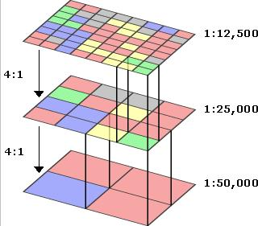

## 瓦片系统
####瓦片底图
地理信息量往往很大，计算都传到本地，一起渲染也注定死机。但我们很可能只需看到视窗范围内的数据。最普遍的方法是把所有的图渲染成图片，存在服务器，根据屏幕视窗的大小，动态地判断需要哪几张图片，然后把那几张我们需要查看的图片下载下来。

为了使瓦片的数量不要太多，我们限定了缩放的等级，通常为0-18级，每增加一级，瓦片的数量变成之前的4倍。加一级，瓦片多很多，但我们的视窗内的瓦片数量基本不会变。

| 缩放层级（zoom） | 瓦片（tiles）的数量 |
| ----|:-----:|
|0  |1|
|1  |4|
|2  |16|
|i  |4^i|
|18 |68,719,476,736|

这就是所谓瓦片地图服务（TMS,tile map service）, 我们用的百度高德地图莫不如此。

##### 图层叠加模型
行政区划、山体水系、道路房屋、商圈分布、车辆轨迹，地图的要素好多啊，每次我们只是看若干种类型，怎么组织这些数据？
大多地图工具都以"层"管理这些地理要素，如GIS。比如我们在地图上画1000个人的分布，往往分两层，底图底图层（地理数据）和包含1000个人的点的层。
简单地理解层，就是我们把3d的地理要素拍平（或者说投影project）按照顺序叠在平面上。
层有很多组织方式。比如，业务的角度，我们将一张地图分成 基底、道路、标注，而绘制的角度，我们分成瓦片层、svg层、canvas层等。

#####贴图
普通地图为展示地理数据本身而生，可视化地图为展示地图上的数据为生。

## 矢量图层（svg）& 地理数据

##### 数据格式的表示与转换

