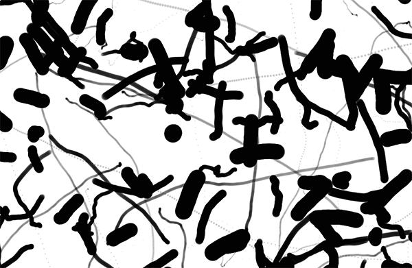

# 粒子系统1
[美的数学世界系列](http://hotu.co/blog) | `野狩`
<iframe src="./particle_code/2_particle_brown_3/" width="100%" height="300px" frameborder="0" scrolling="no"></iframe>

一种观点说，世界是一群相互作用的粒子(原子)，任何物体本质上就是一堆点。再比如屏幕就是一堆像素点，无论电视里放什么，归根结底就是一群会发光的点在变颜色。

电脑里我们可以把点画出来，单个点是粒子，一群点是粒子系统(particle system), 我们常常用粒子系统去模拟液体急速的湍流、燃烧的火焰，鸟群的飞翔，甚至动作片巨大的爆炸。有时我们看到点群丰富的聚集状态、有时感受到点群难易言说的运动节奏、有时我们压根就没发现这是一群点，海量点群体的特征给我们带来了现实的感受。


如何做出粒子系统？

## 物理模拟
创造粒子系统，最直观的是用物理规律模拟现实。

所有物体都在物理定律下相互作用，中学我们就知道: 世界像一台巨大的机器，所有物体都受力学规则的支配，地球上所有物体都有向下的吸引，行进中总会遭遇逆反的阻力，被弹簧拉着的小球永远受到面朝弹簧中心的拉力，而无论绕太阳椭圆运动的地球，还是沿着抛物线或双曲线行走的彗星，都是万有引力的杰作。从这里开始，我们发展了很多基于运动和物理的动画模拟，例如运动学模拟(kinematics simulation)、刚体动力学模拟(rigid body dynamics simulation)、绳子/布料模拟(string/cloth simulation)、柔体动力学模拟(soft body dynamics simulation)、流体动力学模拟(fluid dynamics simulation)等等。

面对复杂的情况，先是万变不离其宗的受力分析。对于每个受力的物体，我们算此刻的受力总和(这种相加就是矢量的相加),根据受到得合力，我们就能计算物体的运动:
受力的物体会产生加速度，我们通过牛顿第二定律 f = ma 算出加速度，加速度累加在速度上，速度累加到位置上，知道了所有的点的位置，物理题一般就解完了（我们也可以在电脑上把结果画出来了）。

通常中学的题目里，我们遭遇的都是恒力，我们通过一些简单的方法去计算位置，可事实上，自然界是如此复杂，受力无时不刻变化，加速度、速度、位置也是如此，复杂性足够搞晕我们战斗力渣渣的肉脑。直到后来牛顿莱布尼兹发明了微积分（微元法），研究了一套对瞬间的累加计算的方法论，并得到解析的结果(结果用函数表示，理论上无限精确)。在微积分野蛮生长的17-18世纪，数学家的信心逐渐爆棚，比如拉普拉斯说，告诉我宇宙中每个粒子的位置速度和现在的时间，我可以(解微分方程)计算宇宙的历史和未来。这么理解，我思考这句话本身也是脑细胞的运动(一堆粒子互相作用)，是可以计算的。如果拉普拉斯足够吊，就可以预言200年后我在思考他说的话！

<!-- 拉普拉斯的话导致很多人相信宿命论，反正粒子的运动确定，物理定律确定，未来是确定的，这就是著名的。有许多方式驳斥拉普拉斯，除了混沌和不确定性原理，计算本身还必须靠物质，计算机的计算力能足以算准组成自己的原子的运动嘛？ -->

世界就是个巨大的、受力学支配的粒子系统，只要超级大的计算能力就能算出未来。这导致很多人相信宿命论（科学宿命论，未来是可计算的)。可对复杂的世界，微积分的表现力很有限，比如微积分解物理题，往往先列一组微分方程，然后慢慢解，但有很多无解(无初等函数解)的方程。还有后续混沌效应、量子级别的不确定性，还有计算本身就需要消耗大量物质...我相信我们永远不能从世界这个巨大的粒子系统里解出未来。还是从离题中回来吧。

虽然微分方程难解，但计算机是可以硬算滴, 近似一下，立马算完，要什么微分方程，高中物理加一点线性代数就已足够（牛顿蜀黍已哭晕有木有）！

虽然力、加速度、速度和位移都随着时间变化，但我们可以把时间切碎，分成一个个很短暂周期，对个周期，设时间间隔为dt，对于每个粒子，执行以下步骤：

1. 算受力：把所有受力加起来算个和(如引力、弹力、阻力、粒子间互相作用力等等)
2. 算加速度：通过受力规则(如f = ma)， 根据粒子的质量，算出粒子的加速度，
3. 算速度：通过加速度，更新粒子对象存储的速度 v = a * dt。
4. 算位置：更新粒子对象存储的w位置 s = v * dt。
5. 画出来：根据现在粒子的位置，把粒子在屏幕上画出来。
我们可以把1-4理解成模拟阶段（Simulation stage），也就是只算数字，不画出来， 然后第五步是绘图阶段（Rendering stage）。当然这些步骤不完全准确，现实中会更灵活些，每个步骤也不是都必须的。

### hello world，匀速运动，一个小屏保
先做一个最简单的粒子系统。为尽量简单，粒子都是圆，质量都为1，并且不受力(没有加速度)，在2d平面上运动，初始化的时候产生一定数量的粒子，之后粒子数不增不减:

1、构建绘图环境:

画图先备纸。浏览器里有很多绘图环境（可以理解成纸和笔），我们选canvas。canvas即画布，是一堆像素和一些绘制方法的集合，我们可以在上面画任何东西。我们在html里定义好container（详见代码，不累述），然后用javascript取出container，在container容器里，放置一个和容器一样大的canvas，我们就可以在canvas上画图了。注意最后一行，canvas不能直接画图，必须取出ctx,画图的所有操作，都是在ctx上执行的。

这段代码是用原生的方法实现的（jquery等js库更方便），很简单，以后不重复写了。

```js
//创建画布，每个案例都差不多
var container = document.getElementById('container');//取得放置canvas画板的容器
var canvas = document.createElement('canvas');//创建canvas画布
canvas.width = container.offsetWidth;//把容器的宽度赋予画布
canvas.height = container.offsetHeight;//把容器的高度赋予画布
container.appendChild(canvas);//把画布放入容器
var ctx = canvas.getContext('2d');
```

2、粒子对象的设计

最好把每个粒子理解成对象，每个粒子都有自己的速度(x、y)、位置（vx、vy）、填充色(color)、半径(radius)的属性。这些都会初始化函数（构造函数）里完成，执行后，粒子对象就产生了，我们把粒子对象单独写成一个类，写在一个独立的文件（particle.js）里，这样不会产生很长很难读的代码。对这段代码注意几点: 首先速度是矢量，因此在这里，我们把速度分解成vx和vy2个量，我们给每个点一个随机速度，利用Math.random产生，但此函数产生 0-1的数，如果将结果减0.5，结果的范围在 -0.5 - 0.5之间，这样小球就可四处发散了。

```js
function Particle(ctx, x, y) {
  this.ctx = ctx;
  this.x = x;
  this.y = y;
  this.vx = Math.random() - 0.5; //x速度随机
  this.vy = Math.random() - 0.5; //y速度随机
  this.radius = Math.random() * 50;
  this.color = 'rgba(0,0,0,0.2)';
}
```

粒子对象还需包含将自己画出来的方法。回顾前面的流程，我们为粒子对象写两个方法:
update -> 模拟阶段（Simulation stage）
render -> 绘图阶段（Rendering stage）

update只是一些数值计算，电脑里绘图比算数慢，所以一般这个步骤是比较快的，如果这个步骤都卡，基本都会在下个过程里死机。
```js
Particle.prototype.update = function () {
  this.x = this.x + this.vx;
  this.y = this.y + this.vy;
};
```
render涉及到怎样把图画出来，所以选择不同的绘图方式，这个步骤有所不同，我们用canvas，代码里有一些简单的注释。注意开始绘图和结束绘图 最好分别加ctx.beginPath()与ctx.closePath()。
```js
Particle.prototype.render = function () {
  var ctx = this.ctx;
  var radius = this.radius;//粒子的半径
  ctx.beginPath();//开始画图
  ctx.fillStyle = this.color;//设置填充色
  ctx.arc(this.x - radius, this.y - radius, radius, 0, Math.PI * 2);//画一个圆形 canvas的圆是由弧线命令完成的。
  ctx.fill();//填颜色
  ctx.closePath();//结束绘图
};
```

3、管理一堆粒子
当我们设计好单个的Particle的类，我们要在这个流程里管理所有粒子。比如让程序一帧一帧更新画面，比如计算粒子和粒子的相互作用，等等。
代码如下，一共2个函数，init是对粒子进行初始化，并放进数组进行索引，以便更新的时候可以找到每个粒子。init函数只执行一次。loop是一遍遍反复执行的，让每个粒子进行模拟计算（update）以及绘图更新（render）。

```js
var particles = [];
function init(){
  for(var i = 0; i< 200; i++){
    var x = width * Math.random();//随机的x方向速度
    var y = height * Math.random();//随机的y方向速度
    var particle = new Particle(ctx, x, y);//创建粒子对象
    particles.push(particle);//将粒子加入列表
  }
}
function loop(){
  ctx.clearRect(0,0,width,height);//清除上一次的绘图
  for(var i = 0; i< 200; i++){
    var particle = particles[i];
    particle.update();//更新粒子位置
    particle.render();//更新粒子位置
  }
  window.requestAnimationFrame(loop);
}
init();
loop();
```


不管怎样，效果出来了，看起来就是我老婆手机上的动态屏保。

### 随机数,布朗运动和墨水的效果
#### 最简单的布朗运动

注定在任何领域中，hello world都会有点无聊（老子敲了那么久代码，就搞出来一个小黑屏保），能不能更酷一点，让我们找找其他成就感。
让时间回到了1905年，整个物理学都会记住这个学术地震的年代，有个瑞士专利局的年轻人发了三篇吊炸天的论文，除了相对论，有一篇是关于布朗运动的统计理论。关于布朗运动，还要回溯80年，英国的一位植物学家布朗用显微镜观察悬浮在水中的花粉，发现这些小颗粒都着了魔一样，在做一种奇妙的无规则运动。后来大家觉得，这是水中的分子撞击花粉的缘故，水分子运动激烈而无序，所以所有的粒子都在瞬间换成了另一个随机的速度。
不管怎样，我们可以改改上一个demo，做个简单的布朗运动模拟。最粗暴的是我们只是赋予每一帧里每个粒子都获得一个全新的，随机的速度。现在，我们只要修改Particle.js这个类的几行，就可以模拟布朗运动了（为了效果，改了点的数量、大小、填充色，详见案例）！

```js
Particle.prototype.update = function () {
  this.vx += 0.2 * (Math.random() - 0.5);//新加的代码
  this.vy += 0.2 * (Math.random() - 0.5);//新加的代码
  this.x = this.x + this.vx;
  this.y = this.y + this.vy;
};
```

哈哈 大功告成了，你看看demo，应该就觉得结果还不错（不贴图了，图片无法表现动画），反正我是觉得效果已经很像屏幕是浑浊的脏水了。

#### 动量守恒
但我们可以做的更好些, 大颗粒的肯定懂得慢，小颗肯定粒动的快，请回忆:
##### 物理老师: 同学们，记住了，动量的变化量等于冲量，p = m * dv ！！！

因此，两物体相撞，两个物体改变的动量是相等的。我们做一个很粗糙的假设，所有的小颗粒碰撞动量都一样，设为p，因此每个物体速度的改变为 p/m 。还记得我们在初始化粒子的时候，有个radius的量，即半径，设所有粒子的密度为k，质量就是 密度 * 面积（2 * PI * radius * radius * k）我们在初始化的函数里增加两行

```js
function Particle(ctx, x, y) {
  this.ctx = ctx;
  this.x = x;
  this.y = y;
  this.vx = 0.5 * (Math.random() - 0.5);
  this.vy = 0.5 * (Math.random() - 0.5);
  this.radius = Math.random() * 5;
  var k = 2;// 密度
  this.m = this.radius * this.radius * Math.PI * k;// 质量 = 密度 * 面积
  this.color = 'rgba(0,0,0,0.6)';
}
```
那我们该需要修改函数update，首先每个粒子都获得一个大小一定的动量，大小为p，方向随机，设其角度为phi，我们根据这些条件 求出速度的该变量，然后再跟新位置，代码如下:

```js
Particle.prototype.update = function () {
  var p = 5;//获得动量的大小
  var phi = Math.random() * Math.PI * 2;//动量的方向
  var dv = p / this.m;//改变速度的大小
  this.vx += dv * Math.cos(phi);//对现在的x速度进行更新
  this.vy += dv * Math.sin(phi);//对现在的y速度进行更新
  this.x = this.x + this.vx;
  this.y = this.y + this.vy;
};
```

#### 酷炫的轨迹
也许大家都见过延时摄影，在旷野和山巅的夜晚，摄影师彻夜不眠地拿着相机对准天空一拍就是几个小时。因为地球自转，所以所有的星星都沿着一个地球的弧度发生相对运动，然后因为相机长时间开着，所以在ccd上留下了连续的轨迹（事实上就是花了很多点。

这和我们的模型是如此类似！星星是粒子，我们也在画粒子，，我们怎么把这种轨道画出来，这会不会很酷?
其实，这很简单，还记得我们在管理粒子的场景中有清空画布的选项？我们把这行注释掉，就能看到酷炫的图像了！

```js
function loop(){
  // ctx.clearRect(0,0,width,height);//记得注释掉这行
  for(var i = 0; i< 800; i++){
    var particle = particles[i];
    particle.update();
    particle.render();
  }
  window.requestAnimationFrame(loop);
}
```


#### 墨水般的轨迹
上一个版本，我们能感受到物体运动的节奏。不过，我们留下的轨迹还是非常规整。但如果我们对轨迹加随机的偏移，就会有更有趣的效果，看看这是不是和墨水一样呢？我们只需要修改两行。
这个案例就是文章开头的动画:

```js
Particle.prototype.update = function () {
  var p = 15;
  var phi = Math.random() * Math.PI * 2; 
  var dv = p / this.m; 
  this.vx += dv * Math.cos(phi); 
  this.vy += dv * Math.sin(phi);
  this.x = this.x + this.vx + (Math.random() - 0.5) * 13;//对位移只是增加了偏移
  this.y = this.y + this.vy + (Math.random() - 0.5) * 13;//对位移只是增加了偏移
};
```

#### 三体问题 
没错，三体，历史著名物理学问题，也是现在大红大紫的小说《三体》名字来源，以其诡异而变化无穷的轨迹困扰了大量学者，我们现在要用粒子系统模拟这种神秘运动。

我们知道两个星球互相吸引，通常会互相以椭圆的方式运动，如太阳和地球，有时候也会有抛物线和双曲线，如一些彗星和大质量天体间的运动。但3个星球的运动，就复杂的令人发指。并不是所有情况都和太阳地球月亮的情况一样稳定（他们质量太悬殊了）。

我们动手吧。
首先，三个星球互相之间具有力的吸引，所以，先把这个公式`f=G*m1*m2/r*r`写出来,为了方便，我们把G这个万有引力常数设为1。

```js
function getForce(pt1, pt2){ //计算天体pt2对pt1的吸引。
  var dx = pt2.x - pt1.x;//计算2个点x方向上的距离
  var dy = pt2.y - pt1.y;//计算2个点y方向上的距离
  var distance2 = dx * dx + dy * dy; //计算距离的平方
  var distance = Math.sqrt(distance2);//两点之间的距离
  if(distance === 0) return {x:0,y:0};//如果不幸运动到距离为0，力为无穷大，避免这点吧。
  var f = pt1.m * pt2.m / distance2;
  return {
    x: f * dx / distance, //力在x方向上的分量
    y: f * dy / distance  //力在y方向上的分量
  };
}
```

然后我们就要计算每一个循环中的受力了。在每时每刻，每个天体受到另外2个的吸引，因此预备一个方法 `addForce` 这个方法是用来计算矢量和的，这个没什么可以说的。然后我们再看`loop`函数 ，在这个函数里，首先计算各自的受力(注意，受力的计算需要在更新位置之前全部完成，因为位置和受力互相影响)，然后我们通过受力去影响每个粒子（星球）。

```js
function addForce(v1, v2){//把两个力加起来
  return {
    x: v1.x + v2.x,
    y: v1.y + v2.y
  };
}
//
function loop(){
  //计算受力
  var forcePA = addForce(getForce(particleA, particleB), getForce(particleA, particleC));
  var forcePB = addForce(getForce(particleB, particleA), getForce(particleB, particleC));
  var forcePC = addForce(getForce(particleC, particleB), getForce(particleC, particleA));
  //更新位置
  particleA.update(forcePA);
  particleA.render();
  particleC.update(forcePC);
  particleC.render();
  particleB.update(forcePB);
  particleB.render();
  //执行循环
  window.requestAnimationFrame(loop);
}
```
以上的函数，都是在粒子外部执行的（管理粒子相互的关系），我们还需要对粒子对象进行一些改变。初始化函数基本是不变的，我们随机生成速度和质量，质量越大，轨迹越粗。但update函数变的有点多。首先，外部计算好了受力的总和，在这里传入particle对象，我们根据force的大小，计算出加速度，然后再更新速度，最后做累加。

```js
  var fx = force.x;//力在x上的分量
  var fy = force.y;//力在y上的分量
  var m = this.m;//获取质量
  var ax = fx / m;//获取x上的加速度
  var ay = fy / m;//获取y上的加速度
  this.vx = this.vx + ax;//对x上的速度进行更新
  this.vy = this.vy + ay;//对y上的速度进行更新
  this.x = this.x + this.vx;//对x上的位置进行更新
  this.y = this.y + this.vy;//对y上的位置进行更新
```

如此，大功已成，我们还可以通过一些物理规律，验证程序是否写错了。我用的是动量守恒，先设初始化的初速度加起来等于0，因此总动量为0，因此质心是不变的，在每次循环的时候，我打印出质心`[(m1*x1 + m2*x2 + M3/x3)/(m1 + m2 + m3), (m1*y1 + m2*y2 + M3*y3)/(m1 + m2 + m3)]`的位置，来验证程序有没有出错。
```js
  var cx = (particleA.m * particleA.x + particleB.m * particleB.x + particleC.m * particleC.x) / (particleA.m * particleB.m + particleC.m);
  var cy = (particleA.m * particleA.y + particleB.m * particleB.y + particleC.m * particleC.y) / (particleA.m * particleB.m + particleC.m); 
  console.log(cx,cy);//打印出来，看看变了位置没有
  ```
最后我们能得到很多诡异的曲线，刷新一次，速度随机赋予。到这里，也许就够了，我们已经可以验证这个流传百年的著名难题了。古人不能电脑模拟，证明问题终其一生，也不知道到底轨迹章怎样，不如我们一个小时写个程序，何等苦逼...


更有趣的是，电脑可以模拟物理世界没有的东西，比如受力的公式可以不是`f=G*m1*m2/r*r`，想象另一个世界的三体问题会是怎样？

```js
    function kill(index) {
        if (particles.length > 1)
            particles[index] = particles[particles.length - 1];
        particles.pop();
    }
```

模拟阶段 -> 渲染阶段
## 系统和单体
##### 把显示器的每个像素看做一个质点，电视机就是个粒子系统。在这个层面上，单个的粒子不重要，重要的是粒子和粒子间的联系，他们共同的行为形成了整体。
## GPU粒子
##### 在html中画点，svg可以支持5000个点，canvas可以画10万个点，但是更多呢？


## 性能优化

我们的代码在3体运动时游刃有余，也可以模拟300体运动。但如果有3万体运动呢，如果两两之间受力，一秒更新60次，我们需要计算 30000 * 30000 * 60 次受力。

我们需要近似。

将较远的若干个点当做一个点，一起计算来自他们的分力。举例来说，假设x,y到点集A的质心的距离很远，A包含a个点，则按照定义计算x,y受A的力需要计算2a个分力，而若把A当做一个对象处理，预先计算它的质心和总质量，则完成同样的工作，仅需要a次计算。
[参考](http://todwang.blogspot.jp/2009/01/simulating-n-body-problem.html)

当我们每次更新的时候，每帧更新的时候，遍历一次得到每个节点的质心和总质量。最后，计算每个质点的受力：


快速多极算法  Fast Multipole Algorithm（FMA）


N-Body 模拟问题覆盖了自然科学的很多领域， 从宇观的天体物 
理到宏观的流体动力学，直至微观的分子动力学,例如通过研究围绕 
着银河系的暗物质晕轮的形状和动力学特征来探索银河系形成过程， 
需要模拟数百万的星体和暗物质间的作用。现代生物物理学和化学中 
的许多研究，如细菌或植物体的光合作用膜处发生的光能向化学能的 
转化，染色体中 DNA 和蛋白质分子的描述，都需要模拟上千万的原子 
和分子的作用。

force-layout
Fruchterman-Reingold算法 的[介绍](http://www.infoq.com/cn/articles/GraphX-Intro)


有些参考资料不错
首先是shiffman的 [nature of code](http://natureofcode.com/)

我同事死马将粒子神速地将例子翻译成了[js版](https://github.com/dead-horse/the-nature-of-code-raphael)
