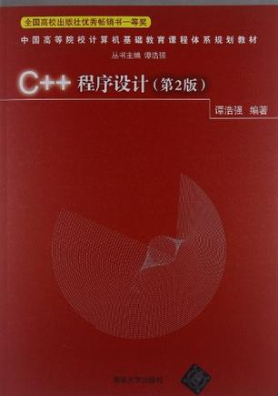
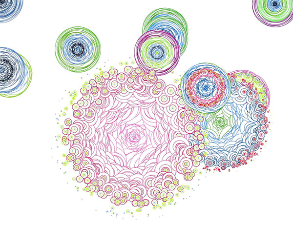
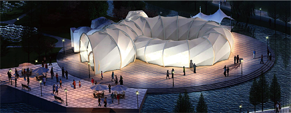
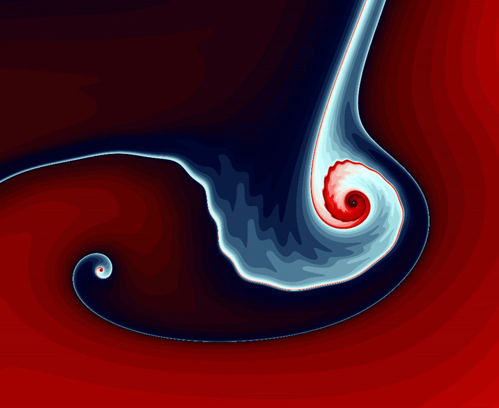
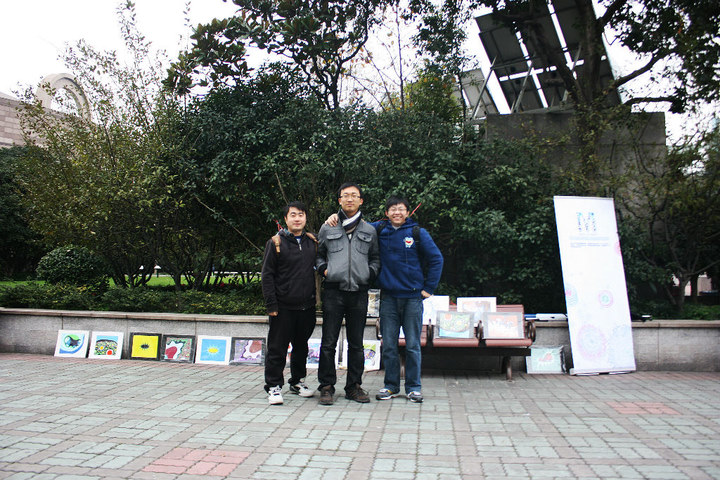
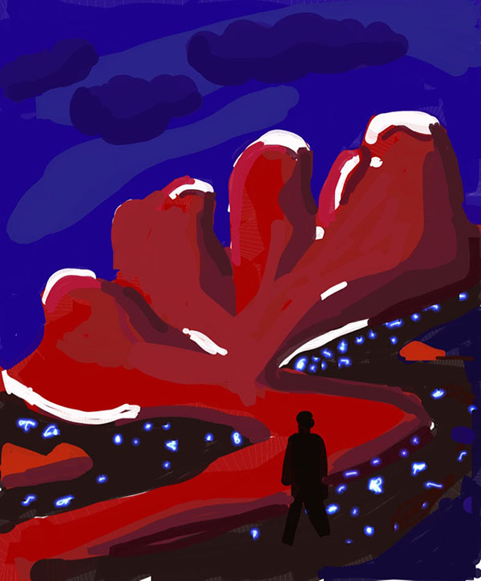
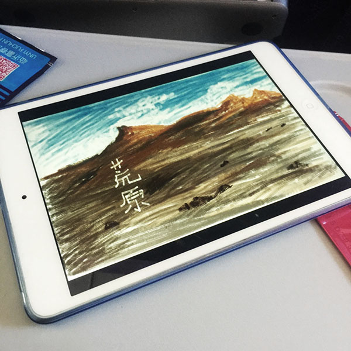
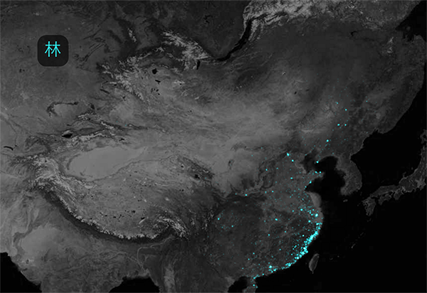
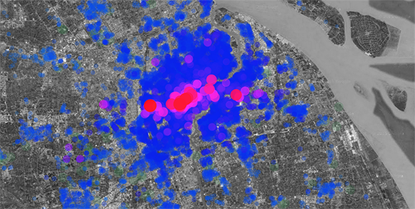

# 7年.设计师的码农路

120年校庆刚结束, 算了下, 已经毕业七年, 算算自己年近三十, 很多回忆都带上了长的数字。

偶尔做个深夜思维漫游。 记记流水账, 写点自己转行的经历：

景观设计 -> 建筑设计 -> 互联网码农。


## 再见c++

高三, 老师说数理化没前途, 计算机过热, 21世纪是生物的世纪, 于是我把生物丢进了第三志愿, 没想真去了。那年盛行'平台式教育', 但种种原因，我们成了学校第一届也是最后一届联合办学的'生农医药大平台'。

四周学霸多, 大一, 印象里大部分考试总要落到中位数以下, 那时有门课c++, 看着那些hello world, 总觉得没什么意思, print几个字有什么软用。然后连续逃课。结果红灯大挂, 50分都没到。大二的时候卷土重修, 依然挂的精彩, 大三最后一次补考后, 忐忑地打开教务处的网站。

60分。

好兴奋, 过了这坎, 这辈子都可以不写代码了!



## 转系到毕业

从生物大平台跑到景观设计, 我想转物理系, 和面试老师聊得不错，但C++挂科也就黄了。

大学浑然度日, 内心自卑, 骑车游荡, 学业荒废。

大三去园林设计院实习, 没工资, 每天骑20km去徐家汇上班, 但老板看我不会什么软件：

『小周, 实习期是2周, 之后你可以别来了。』

『现在学软件, 2周后再看看可以吗？』

『不需要』

我擦 没工资还悲剧...

大四学了一些软件, 比如sketchup, 边学边接了个私活, 去杨浦给一个瑞典人建模型, 挣了700块钱, 真高兴, 和对面寝室连夜庆祝。

可并没什么软用, 09年经济危机, 每周骑车30km去同济面地产和大设计院, 最后收着各种拒信回来。

## 擦肩国企

第一份工作去上海虹桥机场后勤保障处。2009年, 机场扩建, 难得这种国企招关系户以外的同学。

单位非常清闲, 四周同事和爸妈同龄, 上班就是一屏的股票。每天需要去70几块绿地巡视, 记录花草树木的生长情况, 施工队客气地给上香烟, 结束后回去更新一张excel, 记录第几块地的第几棵树现在活得好不好, 算是数字化管理。

下午事情不多, 四点半就下班了。

有时, 自己问自己, 你丫这辈子就这样了吗？

第三个月的时候我决定离开, 临走, 同事、科处长、总经理都聊了一遍, 『小周啊, 这里就是世外桃源, 你以后一定遇不到了』 , 『你六个月内肯定后悔』...

只有副处长说 『走吧, 我儿子我也不会让他来的』

## 景观设计师

工资减了一半, 我去了王老师的设计公司。如果王老师没找我, 也许我还在飞机场养老。

公司主要做市政项目, 也就是公园。和建筑不一样, 做公园比较自由, 俞孔坚大师在秦皇岛做了个500米长的飘带形凳子, 你也不能说他错,会塌了么？坏了会把河岸给压了么？
那时思维离散, 喜欢胡思乱想, 喜欢山寨'大师'的风格, 努力做一小撮让人看不懂的人。每天都想, 怎么做出一个颠覆的方案, 颠覆别人, 颠覆自己, 想做让人一眼就『卧槽,怎么可以做成这样...』的设计, 然而并不认真考虑实施, 总体观也很弱。

老板王老师也给了我很多的时间, 可以自由研究, 看看有没有新技术, 能捏出更多奇形怪状的设计。虽然项目急的时候也会通宵, 但每年好像都有近一半的时间在自己搞自己的东西。

我喜欢发现一种可能性, 喜欢创造本身, 喜欢了解事物背后的原理, 但能不能做出来其实没有那么重要, 在这个宽松的环境里, 实现的惰性被放大了很多倍。某次我问老板, 做了很多东西没造出来, 我的价值何在？老板说项目大家都会做, 创新难, 公司这个规模, 需要要有人去研究创新。

## 参数化设计

老板学历史出身, 做方案喜欢讲文化, 然而我并不是很喜欢这类语言营销, 我觉得设好看就是美, 美在于给人第一眼的感觉, 感觉的精髓就在于几何, 几何有内在的数学逻辑，有时候没什么好多说的。

2010年的一个晚上, 如常打开建筑老牌论坛 ABBS的页面, 看到2个帖子：
[帖子1](http://www.abbs.com.cn/bbs/blog/337106411.html)
[帖子2](http://www.jtben.com/document/846619)

帖子大致是说国外的参数化设计的来龙去脉, 从原理技术到施工, 谈很多定义, 甚至说到不少形而上的东西。

建筑界, 程序辅助设计有2种形式, 1是通过程序去做建筑设计, 统称参数化, 往往是做方案用, 造些复杂的形态, 而对于工程, 软件程序还有一类用处, 叫做BIM, 建筑信息一体化, 主要是如何辅助做施工。

愿景美好, 案例详实, 观点精辟, 正遂我意, 难得有这么个多年难忘的帖子。

怎么通过程序去做设计, 用数学原理、用规则做设计, 用软件工具模拟复杂的、有机的、难以想象的、出乎意料的形态, 用程序实现控制, 输入场地和环境的信息, 进行牵一发而动全身的联动。那年作者foral是一个南加州大学的本科学生, 居然让向来苛刻的abbs大为轰动。我觉得时值今日这些文章也不过时。

上帝用规则管理世界, 而你只需一台电脑。 

还等什么, 兴奋不已, 找软件破解, 搜教程, 逛论坛, 上维基百科, 为每天的进步和日新月异的知识兴奋不已, 半个月后, 学会简单地使用grasshopper写脚本, 这种软件真是适合设计师。

而且心里产生了这前三十年少见的一种直觉：

未来很多年就搞这个了。

## 编程不可怕

写了这类程序才知道, 数学读到高中就够了, 知道点线面、数组、集合、矢量、矩阵、点乘、叉乘这些就可以了。

算法会复杂一些, 但对于grasshopper这类节点式编程工具, 算法都内置写好了, 具体的实现也许洋洋千行, 但你只要一次调用就可以了。你知道输入输出, 能干嘛就好。

整个过程像在学历史, 算法基本靠记。

grasshopper有自己的短板，比如原生的连循环也不支持，因此也有自由编程的模块, python、vbs、c#都是支持的, 不过, 即使代码写的好的人, 在工程里也不会轻易用, 毕竟节点式编程的效率是非常高的。

为了了解代码本身, 我也学习了一些processing。processing是一种艺术家常用的语言, 原理上是阉割版的java, 功能上可以处理位图、矢量、声音、甚至控制硬件。

2010年, 国内做这些还不多, 晚上写着代码, 总觉得有种步入荒原的感觉。




processing小实验

## 处女作品


我的第一批参数化实践是在泰州的公园, 每天晚上在维基百科看的东西都成为了创作的源泉, 比如用彭罗斯镶嵌做了个令人晕眩的地板, 用莫比乌斯带子做了许多公园的凳子, voronoi系统做了园路, 然后又做了个张拉膜包起来的克莱因瓶子, 反正都是数学系统直接改一改用, 整个设计比较张牙舞爪，也都是纯造型而已。

有一座桥，印象比较深，首先我们的总工在图上勾了个复杂的平面图, 我就在Rhino里画出这个图。

然后在grasshopper里写了个程序, 可以控制桥升降变化的曲线（其实就是展开面的变化）, 用正态分布曲线做了个可以调节宽紧程度的桥拱。

这个设计可以做到几点, 两岸的高度随便变, 平面图随便变, 桥拱的支撑数, 陡峭度随便变, 变好了自动生成一个新的方案。

甲方虐我千百遍, 我待甲方如初恋, 写好程序, 随便怎么改。




参数化方案


参数化方案


## 分形世界

2010年, 爱上了画分形。

分形是一个很大的概念, 泛指一切具有无限细节的图形, 比如把一个方块不断地分割，每次分割挖掉几块，形成的海绵般的图形，又比如一根树干分叉了又分叉，不断地来回往复。

而很著名的分形，叫曼德勃罗集合和茱莉亚集合，对于这些图形，只要输入方程，就可以得到一个极为复杂而酷炫的结果，而且还可以缩放，缩放理论上可以无限地缩放，最吸引人的是，分形变化无穷，每次都能突破想象，而且你都不用动脑子，换方程就可以了。

几乎有半年的时间，我基本每天都在电脑前画分形，这些软件是沿着竖条进行渲染的，有时很慢，我就临睡开几个大图，或者视频。

这种巨大的创作兴奋感至今还是很清晰。

还记得那时候还想去市场上卖一把，就去田子坊扫街， 好不容易有一家说可以帮寄卖，不过应者寥寥，于是找了好多基友，去地铁、人民广场、宜家门口摆地摊卖画，和城管捉迷藏。

几个下午，只有一个大爷买了30块钱的画，而且还只是顺便打印的西藏摄影:

『挺好看，但我看不懂是怎么回事，就买张照片支持一下你们吧』

我顺便找印刷厂做了8000张明信片，这些明信片一直送到放到结婚的回礼里，都没有发完。



分形

<!-- ## 自动美学

引老板的话, 梦想还是要有的, 万一实现了呢, 多少有些形而上的白日梦。

存在是什么、时间和空间、认知心理学、预测、人工智能、自动化设计...

作为一个设计师, 我觉得设计有规律可循, 可能可以自动化:

比如简单产生美, 做设计的时候不断减法, 减少颜色、减少形态, 对齐边缘。

比如比例产生美, 大到一栋中国古建筑, 小到一个商标设计, 都有模数可循, 模数就是比例, 比例就是构图, 2:1, 0.618, 根号2这类比例放在设计里往往有效果

等等, 这些能说很多, 你能用语言描述, 就会想能不能用程序描述。

反过来, 程序可以产生大量美丽的图形, 甚至除了形似还有神似, 因为包含一些自然现象的原理, 如何去模拟一棵树的生长（L-system), 鱼群和鸟群是怎么形成有组织的群落, 模拟一个贝壳的模型(大部分贝壳都可以通过调节参数得到粗略的形态), 怎么用有弹性的网去模拟张拉膜的结构, 以至于混沌、分形、元细胞自动机奇妙的世界, 甚至可以用遗传算法去模拟很多很多最优解。

<!-- 而这些理解和传统并不背弃, 古人说画中国画, 三个阶段, 师古人不如师造化,师造化不如师心源, 先找些好画临摹, 然后跋山涉水看大自然, 搜遍奇峰打草稿, 学习之间的美学规律。不过, 大自然最后是要忘掉的, 要通过自己的理解去画画。比如吴冠中谈艺录里说自己画画, 风景都是白天看一眼, 晚上回来画, 他说自己回想的风景的更接近内心, 其实和充满细节的世界不一样。
 -->

<!-- 数学系统产生美，人对美的识别是否也归结到数学？

如果人是一台机器, 我们如何一层层抽象数据参数, 往更高级的神经传递内容?  -->

...... -->


## 工程不简单

然而现实生活, 有个简单的规则叫28定律。

你用20%的时间去做个demo, 却用80%的时间去完成20%的细节, 我觉得往往是 5%: 95%。任何工程都有很多限制, 工期紧张、效果美丽、容易施工、结构合理、建造成本低（模块化）...

看上去挺简单, 一边做, 细节越来越多, 约束越来越多, 折磨不已, 最后精疲力尽地交一个折衷的东西出来。

就像带着脚铐在钢丝上跳舞, 谁都步履维艰。其实各行各业都是一样, 这种复杂, 是很难被程序取代的。

参数化设计也是一样, 你在grasshopper里花15分钟就能捏出一个梦露大厦的大形, 然后想, 我擦, 所谓大师不过如此, 我要早几年, 也是大师了。

每一次信心满满地建立一个模型, 试图去统一一类方案, 小到一个楼梯栏杆, 比如希望做到只要画一根线, 自动在这个方向上生长出楼梯或栏杆。这类程序刚学就会建个大概, 但每当现实情况, 你不得不为这个专门的case写程序, 而且经常被无数细节烦恼。

整个过程就像在高原上爬山, 看上去很近, 其实走几天连山脚都走不到, 每天都是恶心的上下坡。


## 浪迹天涯

24岁, 准备辞职去北京, 期间骑行西藏。但老板口才好, 留人, 于情于理, 说的我没话说, 给了2个月的假期去玩。

我决定这就是我的青春结束之旅, 一定要艰辛而有挑战。2个月, 从新疆到西藏尼泊尔, 一路流浪, 纵情山水, 有时手机一关, 什么事都不想。

托克逊的暴风、西天山的大雪和甘洌的雪水, 无聊的塔克拉玛干沙漠, 希夏邦马峰的冰川, 樟木的深谷和几乎垂线的瀑布...

在碧蓝如洗的高原湖洗脚, 在帐篷里读明朝那些事, 享受一个人的寂寞和安静。

才发现, 自己完全可以2星期不说话, 望着远方胡思乱想、写诗、琢磨摄影的构图, 听巴赫和汪峰的歌。

衣衫褴褛地回到汉地, 又走了北方8省, 直到某天, 走得有些懈怠, 在哈尔滨的肯德基睡了一觉, 不知做了什么梦, 睡的心慌。

有一种一种平静的满足感和淡淡的空虚: 日复一日的旅行, 并不能填满你人生的空白。

收心吧。


## 回到上海

回到上海, 依旧是2点一线的生活。

我做的项目越来越少, 研究越来越多, 心里有点空虚。参数化也发展到了瓶颈, 能用grasshopper写比较复杂的项目, 但真正编码能力很一般, 也有些有成就感的事情, 比如通过等高线计算一个巨大无比的工程的土方量, 把两个人两周的工作量减到一个下午。

不过, 不过如此。

grasshopper内置的算法无非几种, 玩腻了, 有些复杂的idea实现不了, 别人做的东西基本也都知道, 炒冷饭, 论坛里都是些翻来覆去的问题, 逐渐淡了。

项目里, 用参数化工具完成一些施工图, 但也不知道到底行不行。我对施工没那么大热情和坚持, 其他人也没经验, 老板有时候向甲方推荐深化的方案, 有时又不明不白地被甲方灭了。直到我离开这里, 印象里只有一个泰州的雕塑做出来了。

每天晚上, 我都读一些旁门佐道的知识, 比如数据可视化、表演、数字艺术云云的, 反正, 这几个领域都有不少数字化实践：有数学原理, 用程序实现。

看到特别有意思的, 就盗版到自己的人人小站数学的美学世界, 这一年, 数学的美学世界从几百人一下子飙升到了十几万人的关注量, 发一个贴里面就有十几个评论。但增长的原因令我也莫名其妙及, 而且至今也甚为不解, 后来做微博和微信, 没一个做成功的。

## 梦幻北京

建筑才是参数化设计的舞台, 景观没有足够的投资和重视度。

有许多形态妖娆的建筑, 但看久了也就索然, 在国内的各个参数化设计的事务所里, 我最喜欢王振飞的HHD-FUN。FUN相对是理性的, 又喜欢用数学系统, 步步推演, 而且考虑国内的施工水准。

微博联系了老板飞哥, 一份作品集, 一个电话, 我带着自行车和三袋子家当跑到北京。

北京, 梦幻的一年, 心理上的痕迹比近来三年的时间还多, 我住在二环外的仓库, 白天蓝天大树和稀疏的阳光, 晚上则是昏黄的路灯和烧烤摊。二环内古老的胡同, 许多地方比三线城市还旧, 然而一座一个亿, 胡同外围安放着各种牛逼哄哄的国家部委, 看起来可能也和大多老房子无异。你会遇见很多乐队和诗人还有满街的互联网创业者, 总让人觉得这是个房屋低矮, 理想远大的城市。

飞哥的公司非常务实, 印象里, 一年只开过2个会, 其他时候大家各自干活。有个项目经理说, 从3月到10月, 她基本没有在11点前回去过。不过飞哥好像也见惯了, 说他自己年轻的时候, 一年只休息5天, 二十几岁就主持大型酒店的总体设计了。

所有参数化相关的方案, 基本飞哥都亲力亲为, 我们辅助深化。

飞哥基本全能, 谈项目下工地, 画草图建草模写程序, 据说有时开会无聊还会亲自打灯光渲效果图。

飞哥也是一个非常追求极致的处女座男, 经常会说你的模型没开捕捉, 差了几毫米, 也会叫你把一个扶手的连接部位用vray渲染3个视角的效果给他。

这和前公司是迥异的风格, 前公司项目批发, 做大项目, 这儿有时候很小, 小到设计楼梯和凳子; 前公司方案经常大面积的推翻重来, 这里做方案基本是步步为营, 在每一次深化的时候出3个方案, 飞哥选一个, 大方向就不会变了, 前公司喜欢用文化营销方案, 飞哥基本不提, 做事为主。

这也是我喜欢的一点, 有时候看到简单的算法被赋予文化哲学, 写出一篇估计作者都看不懂的文字, 心里看着非常难受...

我们基本就是帮飞哥做深化了, 很多简单的问题, 到了飞哥这边也会约束很多, 小到设计一个穿孔铝板, 要保证打孔的模数, 又要看起来有连续性, 还要考虑透光率, 边沿至少要留多少空间, 此外还要小孔对齐关系有些韵律可言, 这些细节, 连我这种设计师都觉得并不明显, 做的时候有时很颓废：

东西都是会的, 但很麻烦。

更要命的是我建筑学知识很少, 对施工也不怎么感兴趣, 太多的细节都要被专业牵着鼻子走。

## 裸辞3月

13年4月, 我又辞职了, 骑一辆自行车, 随着下班滔滔的人流去内蒙古。

人生中第一次纯裸辞, 颓废, 兴奋, 迷茫。

不知道明天的感觉也挺好。

我们去库布奇沙漠, 路不艰险, 带着笔记本和帐篷, 白天走路, 晚上编码。那时正值体感硬件盛行, 便研究leapmotion, 在此基础上写游戏玩。最初我只会processing, 但是任何会编码的都说学会eclipse才是王道, 不过对我太复杂了。

还好小易也在, 小易写过java 也搞过python, 还为eclipse写过插件, 但这并不是最重要的, 他总是三言两语把复杂的问题讲简单, 思路清晰, 上手即用。正统的程序基础知识, 最早是和他学得, 比如在西直门的破旅馆里, 和小易和小柯同睡一张破床, 大家一起聊数组、字典、列表、接口和抽象类是怎么回事。

从沙漠出来, 带着小易出去旅行, 白天骑车, 晚上问程序问题, 这么多年, 第一次故地重游, 走三边地区, 看古长城和去中国波浪谷靖边龙洲乡, 为的保证旅行的品质😄。下午笔记本一开睡一觉, 树影稀疏, 放会音乐吹吹干燥的春风, 如此人生实在快意。

旅行回来, 积蓄没花完, 就在北京的胡同里深居简出继续写java游戏, 每天去茶馆, 30块钱一天的消费, 占着位置从早上到深夜12点, 老板气的快要赶我走了。

乐总说, 你其实并不是喜欢创业, 而是喜欢创造本身的感觉, 我心里一惊, 这是一句自己好像知道，但不想说出来的话。

小游戏就这样随着热情淡却无疾而终了, 事实上, leapmotion后来几年也就是个玩具, 并没有长足的发展。


## 建筑再见

每一次离开和放弃, 心里多少还是有些波动的。

想起初识参数化设计最初2个月内心的激动, 想起在互动百科上读着弗兰克.盖里的简传感动得泪下的夜晚, 想起几年里硬盘里搜集的几百G设计资料...

我花了一星期写简历, 心怀忐忑地寄给了微博的红人玄澄, 事实上我关注这个账号已经半年了, 半年里还经常通过淘宝的朋友打听玄澄团队的变化, 但我不敢贸然联系, 不想得到一个简单的拒绝。

在我离开北京前往青海的前一个昏暗的下午, 收到了玄澄的电话, 面试很细致, 作品集的方方面面细节都聊到了, 但非常顺利。

后来又面试了2次, 不过都很顺利, 一个是江湖上著名的Winter, 一个是精通任何算法, 心态天真的空海博士。

人生总有转折, 机缘巧合, 贵人相助。没有写过一行js代码的我, 竟然混进了阿里巴巴。

离开北京的时候, 乐总帮忙在西海办了一个数字艺术的画展, 然后揣着一千多块钱, 和20多个朋友一起通宵唱歌。

临行暴雨, 不过也就一个小时到了南站。

再见, 梦幻般的北京。


## 阿里巴巴

带着一屁股信用卡欠款回到了杭州, 下了火车, 湿气袭来, 绿色葱翠, 只是想起10年前就在40公里外读高中, 心里有些失落:

转了一圈, 三十岁前就这么回来了。

阿里巴巴有几个不同以往公司的地方:

一个是自下而上, 从前的两家公司, 老板能力都很强, 事事操心, 而阿里比较平等, 老板也不全才得BT, 每年上面定个大目标, 下面自己给自己定小目标, 自己有点决定权, 但优胜劣汰, 大量产品都死在开始后几个月里。

二是屌丝和无节操的文化, 至少有几千万股票的老板, 常常也许就穿拖鞋做公交车上班, 朝你屌丝地嘿嘿一笑, 而新人入职需要破冰, 破冰大致就是给10几号人详细讲述自己和前前女友OOXX的故事。

产业现状也和我想象的大不一样, 总觉得在高大上的互联网公司, 数据搜集和汇总根本不是事, 现在拼的是人工智能么... 但事实上, 并没有那么高大上。

举个例子, 数据库, 互联网的基石, 也在拆东墙补西墙, 比如没有一个集群, 可以算的多又算得快, 所以, 需要根据不同的需求, 设计不一样的集群来完成一些事情, 比如我们周边常见的就有, 海量离线计算、实时计算和流式计算, 而很多任务需要不同的集群支持，有时去找某个集群做个计算还要排队, 所以整个生态是很复杂的。

周围牛人也还算比较多, 有些算是比较有天赋的, 比如马哥, 写代码比我写这篇文章快很多, 每次只见到他狂敲键盘三个窗口来回晃动, 问题就不明不白地解决了, 有些算是开源界大牛的, 比如苏千朴灵, 都是江湖上很著名的coder, 那年朴灵刚出版了《深入浅出node.js》, 大销一把, 每天对面都有粉丝跑来要签名。

算法在前端团队用的很少, 之前对图形学算法有兴趣，来阿里就不怎么看了,有同事都不知道求两点之间距离的公式，俺当场把嘴长成O字型(但后端能力还挺强)。


## 昼夜编程

进公司的第一天，就用processing.js写了个demo，又花了一个月做了个webgl的可视化demo，但接着工程变大，js文件一下子变成了几十个，学习的进度就开始急剧下降了。

设计师从来就喜欢图形的东西，相比大部分同事都能在各种黑色的命令行面板里来回穿梭，我却带着与生俱来的畏惧感，还记得大学时候用cTerm管理bbs后台，2个学期后还是很厌恶。

项目变大、细化以后，举步维艰，甚至经常怀疑自己的智商。每天晚上，都11点多才回去，还好同事很有责任心，比如剪老板，那会每天都会主动跑来告诉你代码哪写的不对，应该装个什么插件，很有意思的是，这样资深的码农，可以不懂设计效果的细节、不懂复杂的动画，却能在几分钟里一针见血告诉你问题所在。


## 工程化
我们做数据可视化算是前端, 说高尚一些是HTML5, 屌丝一点就是写页面, 但也和普通前端不大一样, 有时候挺像游戏, 是个比较杂交的专业。

印象里, 许多人觉得可视化是花花的东西, 但大部分阿里人讲究实用, 好看不好看，很多人并不是那么敏感，但很多人会问, 这玩意有啥用, 能发现什么问题, 产生什么价值呢？而且与其说艺术和科技的结合, 更多的是解决工程问题, 所谓工程问题, 像极了柴米油盐酱醋, 和生活唠嗑：

『我擦, 为啥页面跑不起啦, 服务器挂了吗, 是数据库出了问题啊...』

『呀, 这个数据洗的不干净, 那么多 null, -99, 你看咋处理呢？』

『这么多代码能看懂么, 过几天自己都忘了哪是哪了』

『变量和放在全局下, 大家一起合作会冲突的, 你咋知道他写的函数不也叫 render呢』

『这页面放久了内存泄露会挂, 咋办？你知道哪个位置有问题吗, 测试要半小时才能发现一次泄露情况啊』

『减少请求个数可以提高访问速度, 你把文件自动合并吧』

『新版本发布后发现有问题, 咋办 老版本能还原吗, 上上个版本在哪里？』

上面很多问题是通用问题，比如模块化，程序如何一层层地去封装，这点也是让我最诧异的，尼玛互联网发展了多少年，看看人家java已经那么完善，你html5党还是五代十国，各种奇形怪状的方案都有，很多库还有副作用...(现在好一点，2013年，大家还写着各种闭包...)


双十一大屏

## 底层旅行

离开北京时前辈A问, 『你去淘宝画几个柱子, 有啥意思呢？』

来阿里，面试的大老板问『可视化这个方向有没有什么挑战？』

『有信心, 和建筑比不算很难啊』

 做建筑的人之所以自信, 是因为软件行业本身就非常成熟, 数据可视化, 在建筑方案里只是的几个diagram而已, 软件连建筑都画得出来, 几个图表算什么虫子？

 但这样的乐观是盲目的, 建筑行业基于软件开发, 层次很高, 站在前人的肩膀上自然走的远, 好比你在现代社会混的如鱼得水, 如果把你丢回原始社会, 你照样活得茹毛饮血, 有本事自己造个iphone出来？

 过去, Rhino里使用grasshopper, 大致经过了类似 OpenGL -> openNurbs -> Rhino common -> grasshopper SDK -> grasshopper这样层层封装, 才到达我们的用户界面。

 但你现在要从比较底层的地方开始, 最底层的是webgl,和opengl差不多，这类编程里，经常想着, 如何减少GPU和CPU的通信, 如何用着色器写GLSL, 如何抗锯齿, 哪个像素应该赋什么颜色, 等等, 底层问题不解决，无暇顾及高级的层面。
 
 另外一点，建筑和互联网很大的一点不同: 建筑是静止的，服务一个甲方，互联网产品都是交互的，服务许多不同的人：

 建筑你只要画一个死的结果就好了，有时候grasshopper里程序写不完，就把结果bake一下，手工改改，差不多也能用，但现在，必须都是完全程序实现的。这不是最重要的，你点击，hover、拖拽这些图表图形都要产生反馈，而不是一个结果就够了，这会比前者复杂不少，而你服务很多人，还要考虑浏览器的兼容、网络传输、绘制性能等等。做建筑，你面对一个甲方就好了，几个领导拍板后，就是政治正确的设计，但如果是互联网产品，也许就是服务百万用户，你需要抽离他们变化的需求中那固定的80%。


## 糊涂画板

每天都像个for循环, 彼此都一样。写着代码在凌晨浓浓的音乐里不想睡去, 梦见死亡临近和飞翔在城市上空, 最后在早晨惺忪的梦境里醒来打开嘀嘀打车, 又是一天。工位和食堂只差三层垂直电梯, 空调间里四季如春, 傍晚连今天下雨还天晴都没搞清楚。

有点惶恐。

是, 我害怕混沌的心态、度年如月的时间、和没有新鲜感的劳动。

在2014年以前, 我会上淘宝买一叠白卡纸, 在无聊的夜晚画一点画, 直到2014年12月, 我想, 其实你写个小应用就可以画画了, ipad和手机都能画 还买什么纸呢?生态环保，画错能改，效果万千。

just do it！

一个晚上我就开发了原型, 但我怎么也没想到, 这个迭代持续了九个月。

因为再小的产品都 = idea + 细节！ 细节！ 细节！ 细节！ 细节！ 细节！ 细节！ 细节！ 细节！ 细节！ 细节！ 细节！ 细节！ 细节！ 细节！ 细节！ 细节！ 细节！ 细节！ 细节！ 细节！ 细节！

你画一幅画, 需要不同的笔刷, 用铅笔打底稿, 用水粉上颜色, 不同的笔刷, 又最好有近似的模型, 可以给出牵一发而动全身的修改, 而不同的笔刷, 需要对参数的不断模拟, 而你升级了画笔, 又要保证过去的画可以继续。如何保存你的画, 如何设计你的文件格式, 要保证一定的压缩比又不至于失真, 画画的时候笔迹要连续, 而且要实时连续。微信里打开画板, 很容易自动退出, 怎么避免自动退出, 如果自动退出, 又如何保存已经画完的画, 画错了可以后退, 退错了可以前进, 画完了可以盖滤镜, 可以播放绘画轨迹, 如何自动判断微信的环境和浏览器环境, 又如何区分用户的权限, 如何在数据库存储文件太大的文件......

麻雀虽小, 五脏俱全, 一个系统超过一定的规模都会变得复杂和难以挪动, 虽然是一个人写出来的, 但你记不住太多的细节, 总是在顾此失彼的修改中拆东墙补西墙。

每天, 加一会班, 回去后在家口的咖啡馆呆到1点, 然后用今天写好的新画笔, 在家门口的小烧烤摊上涂几幅画。

自己写前后端、画画、加插画师为好友聊天、发软文做推广。

可以说这次努力是比较失败的, 微信只积了1000多个粉丝。

不过除了模拟了很多有趣的画笔, 至少懂得了做一个产品的复杂度, 终于可以对说『这个app很简单的, 只要...』的人说：

呵呵...




糊涂.钢笔画笔作品



糊涂.铅笔画笔作品


## 数据分析       

造轮子的不一定会开车, 写图表的未必会数据分析。

你明白一个可视化图表是怎么个结构, 怎么处理数据, 怎么和鼠标交互, 怎么去控制渲染, 但也许你不怎么关注能用这些做什么，比如咨询公司也玩着数据，我们和尼尔森合作，他们出的报告也是折线饼图，算法上加减乘除，他们能从大客户那忽悠不少钱，你行么......

又如一天我在公交车上和和某品牌的电商部的哥们聊天, 我发现他比我懂数据产品。

用户隐私是网站的生命，阿里作为一个很大的公司，从某年开始对数据进行了非常严格的管控，其实我们做数据的都接触不到数据，那又谈何形成对数据的敏锐性呢？2014年9月, 我写了一个爬虫爬取搜房网的数据, 试图分析一下上海的房价，才发现一切都比想象的容易, 听上去很高级的爬虫，其实也没几行代码，就这样，把点通过经纬度画在地图上，上海的房价形势非常清晰。

当用一种新的视角看待城市的时候，内心是震撼的，就像第一次打开google earth发现山脉的规律，又如在不断改进的过程中，觉得自己的图表有很多问题，基础功能的改进仰赖一次又一次实际需求的磨练。

忽然觉得，闭门造车地去做数据可视化是很难进步的，而我们需要数据，而数据，有2个来源是很方便的，一个是爬虫，一个是黑客脱裤放在网上的数据库。

脱裤是拖库的谐音，大致的意思是黑客入侵了网站后台，把整个或一大部分数据库拖下来，比如执行了一个 ``` SELECT * FROM xTBALE``` 的命令。最著名的脱裤，莫过于2011年帮如家等快捷酒店管理用户信息的第三方公司身份信息泄露，和差不多那会csdn、微博和人人网的账号密码泄露。

脱裤不可求，爬虫可以改进，有了爬虫，整个互联网都是你的数据。

你可以找酒店的价格、火车票的信息、城市里的餐厅的价位和位置、区域和细节的房价、铁路的出发信息，进而发现整个城市的心跳和脉搏。互联网就是一个神奇的东西，当所有商家在积极地网络营销和上传信息，这些信息本身就构成了一个自下而上，自发的数据更新流，这种实时性是历次国家行为，比如人口普查和经济普查很难做到的。

从写第一个爬虫到现在，经过了大半年的时间，这整个过程，和过去很多产品或框架的迭代很像:最初花一点点时间就捏出了一个demo，然后做很多很多单独的小case，最后发现这些case很混乱，乱的顾此失彼，修改了这个影响了那个，而各自独立的代码可能自己都忘了当初怎么想的，就去生产一个大而全的的框架。

这些是我现在正在玩的东西，有一些已经做好的结果，比如通过微博泄露的密码分析人设计密码的心理，也如通过开房数据寻找姓氏的分布，还有房价相关的分析，近期会发出来 😄

贴一张有意思的图，根据酒店开房的身份证地址进行geocoding，得到出生地的经纬度，画在图上，这是近万个林姓在中国的分布。他们主要在长江以南，犹福建广东为甚。

我恍然大悟地想到了各种林氏名人都源于福建一带，林则徐、林语堂、林徽因、林丹......

大数据和小样本就这样相互印证了。




林在中国的分布



上海房价分布

## 该结尾了

我觉得人生多少有点戏剧性, 比如从08年c++补考结束的解脱, 到现在吃饭睡觉外只剩代码的生活。

6年, 从小白开始, 现在应该能算一个互联网行业的准全栈工程师了。

对于编程, 我的天资应该在后50%的人群里, 但也走到了这里。

我想到一个比方:

很少有人能不用氧气瓶登上8000米的山峰, 大部分人却能凭着意志在5000米的高原奔跑。

其实能爬到5000米也很精彩。

不羡慕天才, 父母所赐, 使好现有的心智, 也能很精彩。

这是一个多元化的世界，自由地学习，自由地转行。

工资少点也能活啊。

谢谢读到这里的人, 也希望对你能有一点用。

最后聊聊程序本身。

有些人外表无趣, 内心火热, 我觉得程序也有这样的性格。

写完 Hello world 在黑黑的窗口打印出2个小单词, 很丑很无趣。

但有一天, 你控制了许多东西, 自动化你的流程, 解放你的工作和生活, 验证你的猜测, 创造你的作品, 用上帝的视角去理解这个世界。

迷雾散去, 眼前是一座值得用上千个寂寞的夜晚努力攀登的山峰。

不仅是36kr迷乱的创业梦, 更重要的是你上下求索的极客心。

还等什么？

just code it.
